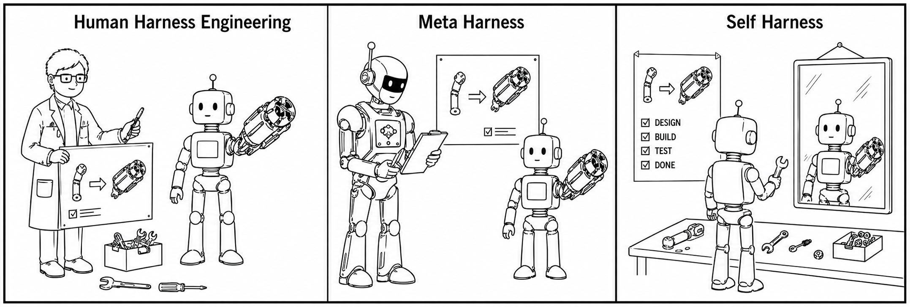
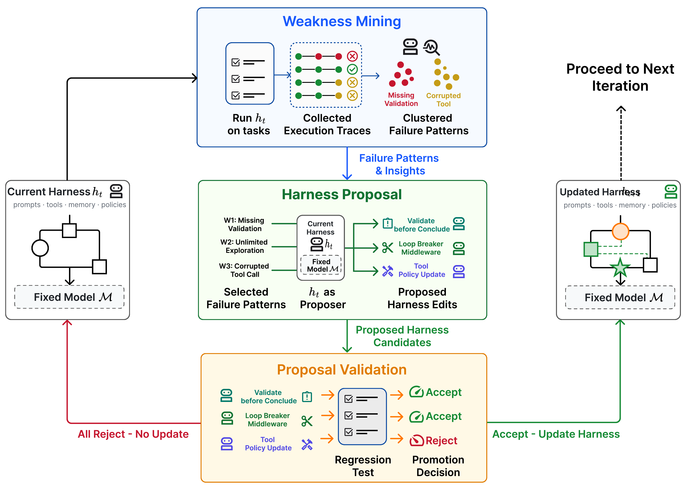

# Self-Harness: Harnesses That Improve Themselves

<p align="center">
  <a href="https://arxiv.org/abs/2606.09498">
    
  </a>
</p>

<p align="center">
  
</p>

## Overview

Self-Harness keeps the model weights and evaluator fixed while improving the
surrounding harness. Each round evaluates the current harness on tasks, mines
failure patterns from execution traces, asks the same model to propose bounded
harness edits, and promotes a candidate only when held-in and held-out
regression checks support the change.

<p align="center">
  
</p>

## Results

Terminal-Bench-2.0 pass rates (%). More results are coming soon.

| Model | Initial | Self-Harness |
| --- | ---: | ---: |
| MiniMax M2.5 | 42.2 | 53.9 |
| Qwen3.5-35B-A3B | 18.0 | 36.7 |
| GLM-5 | 46.1 | 57.0 |

## Reproduction

This checkout includes an auditable reproduction of the Self-Harness mechanism.
It covers weakness mining, bounded harness proposals, regression-gated
validation, artifact freezing, and a sealed evaluation stage. It does not claim
to reproduce the paper's Terminal-Bench 2.0 scores without the external
benchmark assets and model endpoint.

For setup instructions, experiment policy, and offline/online commands, see
[README_REPRODUCTION.md](README_REPRODUCTION.md).

```bash
python -m pip install -e ".[dev]"
self-harness-reproduce --offline-demo --output-dir runs/offline-demo
pytest -q
```

## Citation

```bibtex
@misc{zhang2026selfharnessharnessesimprove,
      title={Self-Harness: Harnesses That Improve Themselves},
      author={Hangfan Zhang and Shao Zhang and Kangcong Li and Chen Zhang and Yang Chen and Yiqun Zhang and Lei Bai and Shuyue Hu},
      year={2026},
      eprint={2606.09498},
      archivePrefix={arXiv},
      primaryClass={cs.CL},
      url={https://arxiv.org/abs/2606.09498},
}
```
